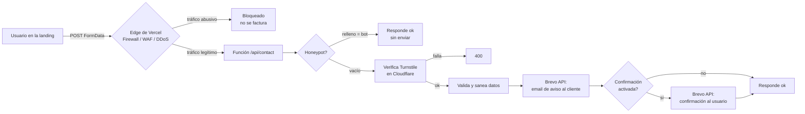

# Documentación técnica — Sistema de formularios en Astro

**Versión:** 1.6 · **Fecha:** 2026-06-29
**Documentos complementarios:** *Guía para hacer formularios en las landings de Astro* (procedimiento de Belén, paso a paso) y *Runbook de ingeniería — Alta de cliente* (tareas de ingeniería: API key por proyecto, autenticación de dominio DKIM/DMARC, entrega a Belén). Este documento describe el funcionamiento interno y sirve de referencia.

**Cómo leer este documento:** está escrito para que sea útil tanto a ingeniería como a quien hace muchas implementaciones sin ser ingeniera (Belén). Las secciones 1–5 dan el modelo mental; las 6–9 son la referencia detallada de cada pieza; las 10–13 son seguridad, coste, observabilidad y el contrato de la API; las 14–15 son extensión y resolución de problemas. El **glosario** (sección 17) explica los términos técnicos. Es válido y recomendable abrir este documento junto a Claude y preguntarle sobre cualquier parte (ver sección 16).

---

## 1. Propósito y alcance

El sistema convierte un formulario de contacto de una landing estática de Astro en un email que llega al cliente y, opcionalmente (desactivado por defecto), una confirmación al usuario que lo rellenó. Está diseñado para el caso mayoritario: **el cliente solo quiere recibir el aviso por email**, sin CRM ni base de datos. Por defecto el envío sale de un **dominio propio compartido** (`forms.xanasystem.com`), sin configurar DNS por cliente.

Cubre: recepción del envío, protección anti-bots y anti-abuso, validación y saneado de datos, envío del email de aviso (con CC/CCO/asunto configurables), y envío opcional de confirmación al usuario.

No cubre (por decisión, ver sección 2): almacenamiento de los envíos, panel de administración, integración con CRM, subida de archivos. La sección 14 explica cómo se extendería si hiciera falta.

---

## 2. Decisiones de diseño (el porqué)

| Decisión | Motivo |
|---|---|
| **Sin servicio externo de formularios** (Web3Forms, Formspree…) | En su plan gratuito esos servicios limitan justo lo que necesitamos (CC, confirmación, plantilla, dominio propio), envían desde su infraestructura (peor entregabilidad y marca) y, al ser empresas fuera de la UE, añaden una transferencia internacional de datos personales que complica el RGPD. |
| **Sin base de datos** | El cliente no la pide. Los datos solo transitan; no almacenamos nada. Menos superficie de ataque y de cumplimiento. |
| **Email vía Brevo por API HTTP** | Ya usamos Brevo. La API HTTP evita el problema de IPs fijas (no usamos SMTP con allowlist de IP) y nos permite enviar desde el dominio del cliente con su DKIM. |
| **Una API key de Brevo por cliente** | Permite revocar o rotar la clave de un cliente sin afectar a los demás y atribuir los envíos por cliente. Cada proyecto usa la key de su cliente, no una compartida. |
| **Endpoint dentro del propio proyecto Astro** | Mantiene cada landing autónoma; no creamos un servicio central que mantener. El coste es activar el adapter y marcar una ruta como dinámica (sección 4). |
| **Protección en el edge (WAF) + en la función** | El abuso se corta en la entrada (gratis, sin invocar la función), y lo que pasa se vuelve a filtrar en código. Así evitamos sustos de facturación (sección 11). |

---

## 3. Arquitectura general

Tres piezas en el repositorio, más tres servicios externos.

**En el repositorio:**
- `src/components/ContactForm.astro` — el formulario visible (HTML + widget anti-bots + JS de envío).
- `src/pages/api/contact.ts` — el endpoint que recibe el envío, valida y manda el email.
- `src/form.config.ts` — la configuración por cliente (destinatarios, remitente, asunto…).

**Servicios externos:**
- **Vercel** — hospeda la landing (estática) y ejecuta el endpoint como función bajo demanda. Aporta también la primera capa de seguridad (firewall/DDoS).
- **Cloudflare Turnstile** — reto anti-bots (sin CAPTCHA molesto) que se verifica en el endpoint.
- **Brevo** — envío real de los emails (transaccional).



---

## 4. Modelo de renderizado en Astro

Astro genera por defecto **HTML estático** (`output: 'static'`): cada página se construye una vez y se sirve desde el CDN. Eso es lo que queremos para una landing: rápido, barato y cacheable.

El formulario necesita una pieza que corra en servidor (para guardar en secreto la API key de Brevo y hablar con los servicios). En Astro 5 esto **no implica convertir el sitio a SSR**. Basta con:

1. Instalar el adapter de Vercel (`npx astro add vercel`).
2. Poner `export const prerender = false;` en la cabecera de `src/pages/api/contact.ts`.

Con eso, **solo esa ruta** se renderiza bajo demanda (se despliega como una función en Vercel); todas las demás páginas siguen siendo estáticas exactamente igual que antes. Astro 5 fusionó el antiguo modo `hybrid` dentro de `static`: el modo estático sigue siendo el predeterminado y se elige por ruta qué se renderiza en servidor con `prerender = false` + un adapter.

**Qué se despliega en Vercel tras el build:**
- Los HTML y assets estáticos → al CDN.
- `/api/contact` → una serverless function.

**Implicación de rendimiento:** ninguna para las páginas. La función solo se invoca cuando alguien envía el formulario; el resto del tiempo no existe coste ni latencia. El `<form>` vive en una página estática y hace `POST` a la función.

> Alternativa (no usada): si el formulario apuntara a un endpoint externo, la landing podría quedarse 100 % estática sin adapter. Es lo que hacen los servicios tipo Web3Forms. Se descartó por los motivos de la sección 2.

---

## 5. Ciclo de vida de una petición

1. El usuario rellena y envía. El JS del componente intercepta el `submit`, monta un `FormData` y hace `fetch('/api/contact', { method: 'POST', body })`.
2. La petición llega al **edge de Vercel**. El firewall y la mitigación DDoS evalúan el tráfico; la regla de *rate limit* sobre `/api/contact` corta los excesos por IP. El tráfico bloqueado aquí **no invoca la función y no se factura**.
3. La petición legítima invoca la **función** `/api/contact`.
4. La función ejecuta, en este orden (fallar barato antes de gastar): honeypot → Turnstile → validación → saneado → envío con Brevo → confirmación opcional.
5. La función responde JSON `{ ok: true }` o `{ ok: false, error }`. El JS del componente muestra el mensaje correspondiente y resetea el widget de Turnstile.

El orden importa por coste y seguridad: las comprobaciones más baratas y que descartan más tráfico van primero, y solo se llama a Brevo (la operación más “cara” en latencia) cuando todo lo demás ha pasado.

---

## 6. El endpoint en detalle (`src/pages/api/contact.ts`)

### 6.1 `export const prerender = false`
Marca la ruta como dinámica (sección 4). Sin esto, Astro intentaría pre-renderizarla y no funcionaría como endpoint.

### 6.2 Lectura del cuerpo
Se lee con `request.formData()`. Si falla (cuerpo malformado), se responde `400`. Trabajamos con `FormData` (no JSON) porque es lo que envía el componente y porque encaja con formularios HTML estándar.

### 6.3 Honeypot
Campo oculto `company`. Es invisible para personas (posicionado fuera de pantalla, `aria-hidden`), pero los bots que rellenan todos los campos lo completan. Si llega con contenido, **respondemos `{ ok: true }` sin enviar nada**: fingimos éxito para no dar pistas al bot de que lo hemos detectado. Es gratis y elimina el grueso del spam automático básico.

### 6.4 Verificación de Turnstile
Se recoge el token del campo `cf-turnstile-response` (lo inyecta el widget de Cloudflare). Se valida contra el endpoint de Cloudflare:

`POST https://challenges.cloudflare.com/turnstile/v0/siteverify`
con cuerpo `secret` (clave secreta del servidor), `response` (el token) y `remoteip` (IP del cliente, informativa).

La respuesta trae `success: true|false`. Si es `false`, el visitante no superó el reto (o el token es inválido/reutilizado) → `400`. Esto frena bots más sofisticados que sí rellenan el honeypot.

> **Importante:** la verificación se hace **en el servidor**. El widget del navegador solo genera el token; quien decide es el endpoint. Por eso la `TURNSTILE_SECRET_KEY` nunca va al cliente.

### 6.5 Validación
Reglas mínimas y explícitas:
- `name`: 2–100 caracteres.
- `email`: formato de email válido (regex simple).
- `phone` *(opcional)*: si se incluye el campo y viene relleno, debe ser un teléfono válido (regex que admite `+`, espacios, guiones y paréntesis; entre 7 y 15 dígitos). Vacío se acepta (campo opcional).
- `message`: 5–5000 caracteres.

Cualquier fallo → `400` con un mensaje claro. La validación de cliente (ver sección 8) es solo UX; **la fuente de verdad es la del servidor**, porque la de cliente se puede saltar. Ambas capas usan las mismas reglas (mismo regex de email y de teléfono) para que el comportamiento sea coherente.

### 6.6 Saneado (anti-inyección)
Dos riesgos cuando metes texto de usuario en un email:
- **Inyección HTML:** si el mensaje contiene `<script>` u otro HTML, podría renderizarse en el cliente de correo. Se neutraliza con `escapeHtml()` sobre todos los campos antes de meterlos en el cuerpo.
- **Inyección de cabeceras:** intentar colar destinatarios o asuntos extra a través de los campos. **No es posible aquí** porque no construimos cabeceras a mano: pasamos un JSON estructurado a la API de Brevo, y los datos del usuario solo van al cuerpo y al `replyTo` (un email ya validado). Aun así, nunca se debe meter input de usuario en `to`, `cc`, `bcc` o `subject`.

### 6.7 Envío del email de aviso (Brevo)
Se construye el `payload` (sección 9) y se hace `POST` a la API de Brevo. Si Brevo responde error (no-2xx), se loggea el detalle y se responde `502` (fallo aguas arriba). El `replyTo` se fija al email del usuario, de modo que al responder el aviso, el cliente le contesta directamente.

### 6.8 Confirmación opcional al usuario
**Desactivada por defecto** (`sendConfirmation: false`). Se reserva para proyectos personalizados en los que el correo de confirmación debe salir desde el **dominio del cliente** verificado (ver 9.2/9.3); activarla sin ese dominio haría que la confirmación cayera en spam.

Si `formConfig.sendConfirmation` es `true`, se envía un segundo email al usuario. Se hace con `.catch()` y **no bloquea la respuesta**: si la confirmación fallara, el aviso al cliente (lo importante) ya se ha enviado y el usuario ve éxito.

### 6.9 Respuesta
JSON `{ ok: true }` (200) o `{ ok: false, error }` con el código adecuado. El contrato completo está en la sección 13.

---

## 7. Referencia de configuración

### 7.1 `src/form.config.ts` (lee de variables de entorno)

Los valores que cambian entre proyectos y entornos **no se hardcodean** en este archivo: se leen de variables de entorno (`import.meta.env.*`) con un valor por defecto de respaldo. Así el mismo código sirve en local (con emails de prueba en `.env`) y en producción (con los reales en Vercel), sin tocar el repositorio. El archivo solo expone el objeto `formConfig` con estos campos:

| Campo | Tipo | Origen / Descripción |
|---|---|---|
| `to` | `string[]` | `FORM_TO` (coma para varios). Destinatario(s) principal(es), al menos uno. |
| `cc` | `string[]` | `FORM_CC`. Copia visible. Vacío si no se usa. |
| `bcc` | `string[]` | `FORM_BCC`. Copia oculta. Vacío si no se usa. |
| `fromName` | `string` | `FORM_FROM_NAME`. Nombre del remitente que verá el cliente. |
| `fromEmail` | `string` | `FORM_FROM_EMAIL`. **De un dominio verificado en Brevo.** Por defecto el dominio compartido `no-reply@forms.xanasystem.com`; el dominio del cliente solo en proyectos con confirmación (ver 9.2/9.3). |
| `subject` | `string` | `FORM_SUBJECT`. Asunto del email de aviso. |
| `sendConfirmation` | `boolean` | Si se manda confirmación al usuario. **Por defecto `false`** (constante en código); `true` solo en proyectos con el dominio del cliente verificado. |
| `confirmationSubject` | `string` | Asunto de la confirmación. |

### 7.2 Variables de entorno

| Variable | Visibilidad | Descripción |
|---|---|---|
| `BREVO_API_KEY` | **Secreta** (servidor) | API key transaccional de Brevo, **específica de este cliente** (creamos una key por cliente). La provee ingeniería. |
| `TURNSTILE_SECRET_KEY` | **Secreta** (servidor) | Clave secreta de Turnstile, usada en la verificación del 6.4. |
| `PUBLIC_TURNSTILE_SITE_KEY` | **Pública** (cliente) | Clave de sitio de Turnstile. El prefijo `PUBLIC_` hace que Astro la exponga al navegador, que es lo correcto: el widget la necesita y no es secreta. |
| `FORM_TO` | servidor | Destinatario(s) del aviso. Coma para varios (`a@x.com,b@x.com`). |
| `FORM_CC` / `FORM_BCC` | servidor | Copia visible / oculta. Opcionales. |
| `FORM_SUBJECT` | servidor | Asunto del email de aviso. |
| `FORM_FROM_NAME` / `FORM_FROM_EMAIL` | servidor | Nombre y dirección del remitente. `FROM_EMAIL` debe ser de un dominio verificado en Brevo (9.3). |

> Regla de oro: cualquier variable **sin** prefijo `PUBLIC_` no llega nunca al navegador. Las secretas y las de configuración del envío deben quedarse en servidor. Nunca poner la API key de Brevo con prefijo `PUBLIC_`. En local viven en `.env` (en `.gitignore`); el repo incluye un `.env.example` que documenta todas.

---

## 8. El componente de formulario (`ContactForm.astro`)

- **Campos:** `name`, `email`, `message` son los que lee el endpoint y **deben existir**. `phone` es opcional (si se incluye, el endpoint lo recoge). Se pueden añadir más (sección 14).
- **Campos obligatorios marcados:** los obligatorios (`name`, `email`, `message`, y el checkbox de términos) se señalan visualmente con un asterisco (`*`) en el placeholder/label. El opcional (`phone`) va sin asterisco. Además llevan `required` y `aria-required="true"`.
- **Aceptación de términos:** checkbox `name="terms"` obligatorio, enlazado a la política de privacidad. Se valida en cliente (no se envía sin marcar). No se manda a Brevo; es consentimiento de UX/RGPD.
- **Validación en cliente (UX):** antes del `fetch`, el JS valida cada campo con las **mismas reglas que el servidor** (6.5). Si algo falta o es inválido: marca el campo con una clase de error (borde rojo), escribe el mensaje en un `<small>` asociado al campo, hace **foco en el primero que falla** y **aborta el envío**. El error de cada campo se limpia automáticamente (`input`/`change`) en cuanto el usuario lo corrige. Es solo UX: la fuente de verdad sigue siendo el servidor.
- **Honeypot:** el `input[name="company"]` oculto. Se mueve fuera de pantalla con CSS y se marca `aria-hidden` y `tabindex="-1"` para que ni lectores de pantalla ni tabulación lo alcancen. No quitarlo.
- **Widget de Turnstile:** `<div class="cf-turnstile" data-sitekey={...}>` más el script `https://challenges.cloudflare.com/turnstile/v0/api.js`. Cloudflare lo renderiza y, al resolverse, rellena un campo oculto `cf-turnstile-response` dentro del formulario.
- **Envío por JS:** tras pasar la validación de cliente, se intercepta el `submit`, se evita la recarga, se hace `fetch` al endpoint y se muestra el estado en `#form-status` (con `aria-live` para accesibilidad). Tras enviar, `window.turnstile?.reset()` regenera el reto para un posible segundo envío.
- **Manejo del 429:** si el firewall limita por exceso de envíos, devuelve un **429** *antes* de llegar a la función. El JS detecta ese estado y muestra un mensaje específico al usuario (“demasiadas solicitudes, espera unos minutos”). Como el bloqueo es en el edge, este mensaje lo pone el front-end leyendo el código de estado, no el código de servidor.
- **Accesibilidad:** labels/`aria-label` asociadas a inputs, `aria-required` en obligatorios, mensajes de error junto a cada campo, estado global anunciado con `role="status"` + `aria-live="polite"`.
- **La página sigue siendo estática:** este componente no obliga a SSR; solo el endpoint lo hace.

---

## 9. Entrega de email con Brevo

### 9.1 API transaccional
`POST https://api.brevo.com/v3/smtp/email` con cabecera `api-key`. Cuerpo JSON principal:

```jsonc
{
  "sender":      { "name": "...", "email": "..." },   // de form.config
  "to":          [{ "email": "..." }],
  "cc":          [{ "email": "..." }],                 // opcional
  "bcc":         [{ "email": "..." }],                 // opcional
  "replyTo":     { "email": "<email del usuario>", "name": "..." },
  "subject":     "...",
  "htmlContent": "<html del cuerpo, ya saneado>"
}
```

### 9.2 Modelo de dominio remitente (defecto vs. confirmación)
Por defecto, **todos los proyectos envían desde un dominio único propio**, `forms.xanasystem.com` (un subdominio dedicado para aislar la reputación del correo corporativo), verificado en Brevo **una sola vez**. Esto cubre el caso mayoritario —avisar al cliente del lead— sin tocar DNS por cada alta.

El **dominio del cliente** solo entra en juego cuando un proyecto activa la **confirmación al usuario** (§6.8): para que ese correo salga con la marca del cliente, se verifica su dominio (DKIM/DMARC) y se usa un `fromEmail` bajo él. Es, por diseño, un proyecto más personalizado.

Por qué este reparto es seguro:
- El **aviso al cliente** es interno: que salga de `forms.xanasystem.com` es irrelevante para el negocio, y el `replyTo` (§abajo) ya apunta al usuario.
- La **confirmación al usuario** sí es de cara al público; ahí el dominio propio del cliente aporta confianza, y por eso se reserva para cuando el proyecto lo justifica.

**Semántica de remitente y `replyTo`:**
- **`sender`** es quién aparece como remitente: por defecto `forms.xanasystem.com`; el dominio del cliente en proyectos con confirmación.
- **`replyTo`** es a quién va la respuesta: el usuario que rellenó el formulario. Así, el cliente pulsa "Responder" y contesta al interesado, no a sí mismo.

### 9.3 Entregabilidad: por qué el dominio debe estar verificado
Brevo envía desde IPs compartidas. En ese escenario, la alineación **SPF siempre falla** (el dominio del sobre es de Brevo, no el nuestro), de modo que **DMARC solo pasa por DKIM**. Por eso el dominio remitente debe tener publicados los registros DKIM de Brevo y estar verificado en Brevo. Con el dominio compartido esto se hace **una vez** (lo gestiona ingeniería sobre nuestro propio DNS); con el dominio del cliente, solo en proyectos con confirmación. Si no está verificado, los emails que salgan de ese `fromEmail` caerán en spam. **Esta es la causa nº 1 de "el formulario no llega".**

### 9.4 Límites y modelo de claves
Usamos **una sola cuenta de Brevo** y, dentro de ella, **una API key distinta por proyecto**. Así podemos revocar o rotar la clave de un proyecto sin tocar las de los demás y atribuir los envíos por proyecto. El **dominio compartido** `forms.xanasystem.com` se verifica una vez en esa cuenta; los dominios de clientes con confirmación se añaden a la misma cuenta cuando aplica (una cuenta admite varios remitentes/dominios autenticados).

Implicaciones de tener una sola cuenta:
- El límite del plan gratuito —**300 emails/día**— es **compartido por todos los proyectos** de la cuenta, no por cliente. Para formularios de contacto de usuarios reales sobra, pero es un techo común: conviene vigilarlo a medida que crezca el número de clientes.
- La **IP de envío es compartida** y el sello “Sent with Brevo” del plan gratuito es a nivel de cuenta (afecta a todos). Quitarlo o aislar la reputación requiere plan de pago.
- Una eventual **suspensión de la cuenta** por parte de Brevo (por exceso de rebotes o quejas) afectaría a todos los proyectos. Por eso importan la verificación de dominios (9.3) y el control anti-abuso.

En resumen: la key por proyecto aísla la **credencial** (revocación, rotación, atribución), no el **límite ni la reputación**, que son de la cuenta. Si los envíos diarios se acercan a 300 sin tráfico real, es señal de abuso (sección 12); si es por crecimiento legítimo, toca plan de pago.

---

## 10. Modelo de seguridad

| Amenaza | Mitigación | Dónde |
|---|---|---|
| Spam de bots básicos | Honeypot | Función (6.3) |
| Spam de bots avanzados | Turnstile verificado en servidor | Función (6.4) |
| Inyección de HTML en el email | `escapeHtml` de todos los campos | Función (6.6) |
| Inyección de cabeceras | Payload estructurado a Brevo; input solo en cuerpo/`replyTo` | Función (6.6) |
| Datos inválidos / payloads enormes | Validación con límites de longitud | Función (6.5) |
| Abuso del endpoint / DoS | Regla de *rate limit* del WAF + DDoS automático | Edge (11) |
| Fuga de credenciales | Secretos solo en servidor (sin `PUBLIC_`) | Configuración (7.2) |
| Factura descontrolada | Bloqueo en edge + Spend Management con auto-pausa | Edge + cuenta (11) |
| Transferencia de datos fuera de UE | Sin terceros: datos transitan a Brevo (UE) y al email | Arquitectura (2) |

Principio rector: **rechazar lo antes posible**. Lo ideal es cortar en el edge (no cuesta nada); lo que pasa, filtrarlo en código con comprobaciones baratas antes de la operación cara (Brevo).

---

## 11. Modelo de coste y facturación (Vercel)

Vercel mide varias cosas por separado (invocaciones, *Active CPU*, memoria, *edge requests*, ancho de banda). Para este endpoint:

- **Las invocaciones son baratísimas** (del orden de céntimos por millón) y el plan Pro incluye un margen mensual amplio más un crédito de uso. No es ahí donde duele.
- Con **Fluid Compute**, solo se factura la CPU mientras el código se ejecuta, **no** mientras espera la respuesta de Brevo (que es la mayor parte del tiempo). El coste por envío es una fracción de céntimo.

**Las tres capas que evitan sustos:**
1. **Mitigación DDoS automática** (todos los planes, gratis): los ataques volumétricos los corta Vercel y **ese tráfico no se factura**.
2. **Regla de *rate limit* del WAF** sobre `/api/contact`: el tráfico denegado en el edge **no genera invocación ni ancho de banda**. Configuración: algoritmo *Fixed Window* (único en Pro; *Token Bucket* es Enterprise), **5 peticiones / 10 minutos por IP → Deny (429)**, con **persistent action** que bloquea la IP infractora durante un periodo (hasta 60 min). El rate-limit solo factura las peticiones *permitidas* (céntimos por millón), que en un formulario son insignificantes; lo denegado/bloqueado no se factura.

   > **Constraint importante:** en Pro la ventana de conteo va de **10 s a 10 min** (1 h solo en Enterprise; “por día” no existe en ningún plan). Por eso el firewall actúa como **escudo de ráfaga**, no como contador diario. La intuición de negocio de que “>5/día por IP es sospechoso” se trata como **señal de monitorización** (sección 12), no como bloqueo en el firewall. Un tope duro “N/día por IP” solo es posible con un **contador en la función** (almacén con estado tipo Vercel KV/Upstash); no implementado por ahora para no añadir dependencias (ver sección 14).

   > **Lista blanca:** la oficina tiene **IP pública fija**, que se exceptúa con la *Allow list* de la regla o con una regla *Bypass* de mayor prioridad, para hacer pruebas de volumen sin autobloquearse. El valor exacto lo facilita ingeniería en cada configuración (no se escribe en los documentos que circulan).
3. **Spend Management** (nivel cuenta, **ya activo**): presupuesto de gasto on-demand fijado en **1 $** (el mínimo que admite Vercel; no permite 0 $), con **notificaciones** y **auto-pausa de proyectos** activadas. Funciona así: el plan Pro incluye 20 $ de crédito que absorben el uso normal; cuando ese crédito se agota, el gasto on-demand empieza a contar, y al llegar a 1 $ Vercel **pausa los proyectos** automáticamente. La exposición máxima a una factura sorpresa es, por tanto, **~1 $ por encima del crédito ya incluido en el plan**.

> Ojo: la auto-pausa es **a nivel de cuenta**, así que un abuso que llegara a agotar el presupuesto pausaría *todos* los proyectos del equipo, no solo el atacado. Es el comportamiento seguro (mejor una pausa breve que una factura abierta), y la regla de *rate limit* por proyecto (capa 2) hace que en la práctica sea muy difícil llegar a ese punto.

> Matiz honesto: el tráfico servido **antes** de que la mitigación automática reaccione, y el de bots no reconocidos como DDoS, sí puede generar algo de uso y normalmente no se reembolsa. Por eso no basta con el DDoS automático: se suman la regla de *rate limit*, Turnstile y el tope de gasto.

(Las tarifas concretas de Vercel cambian; verificar las vigentes en su documentación de pricing antes de tomar decisiones de plan.)

---

## 12. Observabilidad y monitorización

Qué mirar y qué significa cada señal:

- **Aviso de Spend Management (email/SMS):** algo anómalo está pasando. Es la alarma principal.
- **Vercel → Firewall:** picos de *Denied*/*Challenged* en `/api/contact` = intento de abuso (y la regla lo está frenando, que es lo bueno).
- **Vercel → Usage:** *Invocations* o *Edge Requests* disparados sin tráfico real = ataque o bucle.
- **Vercel → Logs / Observability:** errores concretos del endpoint. Aquí se ve el detalle si un cliente dice que el formulario no funciona (p. ej. un `502` de Brevo).
- **Brevo → panel:** volumen de envíos del día y entregabilidad. Si los envíos suben hacia 300 sin usuarios reales, hay spam pasando los filtros; revisar Turnstile.

Recomendación operativa: revisar el firewall y el uso del proyecto tras publicar, y dejar el aviso de Spend Management como red de seguridad permanente.

---

## 13. Contrato de la API (`POST /api/contact`)

**Petición:** `multipart/form-data` con los campos:

| Campo | Obligatorio | Notas |
|---|---|---|
| `name` | sí | 2–100 caracteres |
| `email` | sí | email válido |
| `phone` | no | si viene relleno, debe ser un teléfono válido (7–15 dígitos; admite `+`, espacios, guiones, paréntesis); se incluye en el email solo si no está vacío |
| `message` | sí | 5–5000 caracteres |
| `terms` | sí (cliente) | checkbox de aceptación; se valida en el navegador, no se envía a Brevo |
| `company` | no | honeypot; debe ir **vacío** |
| `cf-turnstile-response` | sí | lo inyecta el widget de Turnstile |

**Respuestas:**

| Código | Cuerpo | Significado |
|---|---|---|
| `200` | `{ "ok": true }` | Enviado (o honeypot disparado: se finge éxito) |
| `400` | `{ "ok": false, "error": "..." }` | Petición malformada, Turnstile fallido o validación fallida |
| `429` | *(respuesta del firewall)* | Rate limit superado. Lo devuelve el **firewall en el edge**, antes de la función; el cliente muestra un mensaje específico (sección 8) |
| `502` | `{ "ok": false, "error": "No se pudo enviar" }` | Brevo devolvió error |

El cliente debe tratar como éxito únicamente `200` con `ok: true`.

---

## 14. Cómo extender el sistema

- **Añadir campos** (teléfono, empresa, motivo): añade el `input` en el componente, léelo en el endpoint (`form.get('telefono')`), valida y mételo **saneado** en el `htmlContent`. No olvides el `escapeHtml`.
- **Cambiar la plantilla del email:** edita el `htmlContent`. Para algo más cuidado y responsive, se puede introducir una plantilla con MJML o React Email; es opcional y no cambia la arquitectura.
- **Varios destinatarios / CC / CCO:** ya soportado vía `form.config.ts`.
- **Adjuntos / subida de ficheros:** **no soportado de serie** y conviene pensarlo bien: implica recibir binarios (límite de tamaño de la función, validación de tipo, antivirus, coste de ancho de banda). Si un cliente lo necesita, escalar a ingeniería; no improvisar.
- **Almacenar los envíos:** fuera del alcance actual (no hay base de datos). Si se requiere, es un cambio de arquitectura: consultar con ingeniería.
- **Tope duro de envíos por IP y día (futurible):** el firewall solo limita por ráfaga (ventana máx. 10 min en Pro), no por día. Para un tope real tipo “máx. N/día por IP” haría falta un **contador con estado** (Vercel KV o Upstash) consultado en la función antes de llamar a Brevo: se incrementa por clave `IP + fecha` y se rechaza con `429` al superar el umbral. **Decidido dejarlo aparcado**; de momento la protección aceptada es Turnstile + honeypot + firewall de ráfaga, que cubre el caso real. Implementarlo en el futuro no rompe nada: es una comprobación añadida al inicio del endpoint.

---

## 15. Resolución de problemas

| Síntoma | Causa probable | Solución |
|---|---|---|
| Los emails llegan a spam | DKIM del dominio no verificado en Brevo | Ingeniería debe verificar el dominio (9.3) |
| **El envío da `200`/`ok` pero el correo no llega** | Brevo **aceptó** la llamada (devuelve `messageId`) pero no entrega: dominio remitente sin DKIM, o cae en spam | Revisar carpeta de **spam** y el **log transaccional de Brevo** (estado `delivered`/`blocked`/`soft bounce`). Confirmar que `FORM_FROM_EMAIL` usa un dominio verificado (por defecto `forms.xanasystem.com`, no el dominio raíz) |
| `401 unauthorized` "unrecognised IP" en logs | Brevo tiene activada la **autorización de IP** (Security & Privacy → Authorized IPs); salta al usar la API key desde una IP nueva | Autorizar la IP en Brevo (enlace del propio error) o desactivar esa restricción. No es la allowlist de SMTP: la API HTTP no la necesita |
| `400 Verificación fallida` siempre | Claves de Turnstile mal puestas o dominio no añadido al widget | Revisar `TURNSTILE_SECRET_KEY` y `PUBLIC_TURNSTILE_SITE_KEY`, y el dominio en Cloudflare |
| `500/var indefinida` en logs | Falta una variable de entorno o no se hizo redeploy tras añadirla | Revisar Environment Variables en Vercel y redeploy |
| El formulario no hace nada | El JS no carga o el endpoint no es dinámico | Verificar `prerender = false` y que el adapter esté instalado |
| `502` al enviar | Brevo rechazó el envío (límite diario, remitente no verificado…) | Mirar el log del endpoint y el panel de Brevo |
| Llega mucho spam aun así | Turnstile no está realmente activo en el form | Confirmar que el widget se renderiza y que el token llega |
| CORS / petición rechazada | Se está enviando a un origen distinto | El form debe apuntar a `/api/contact` del mismo sitio |

---

## 16. Cómo trabajar con Claude sobre este sistema

Este documento está pensado para usarse junto a Claude. Buenas formas de preguntar:
- *“Según la documentación técnica, ¿por qué la verificación de Turnstile se hace en el servidor y no en el cliente?”*
- *“Quiero añadir un campo de teléfono obligatorio al formulario. Dime exactamente qué cambio en el componente y en el endpoint siguiendo este sistema.”*
- *“Un cliente dice que no le llegan los emails. Recórreme la sección de troubleshooting y ayúdame a diagnosticarlo.”*
- *“Explícame qué hace `export const prerender = false` como si no supiera de SSR.”*

Si se le pega este documento a Claude Code dentro del proyecto, puede implementar o modificar el formulario respetando estas decisiones. Aun así, las claves y la configuración de Vercel/Brevo se ponen a mano (Claude no tiene acceso a esas cuentas).

---

## 17. Glosario

- **Estático / SSG (Static Site Generation):** las páginas se generan una vez al construir y se sirven como archivos HTML. Muy rápido y barato.
- **SSR / renderizado bajo demanda:** la página o ruta se genera en un servidor cada vez que se pide. Necesario para ejecutar lógica con secretos (como llamar a Brevo).
- **`prerender = false`:** marca que indica a Astro que **esa** ruta se renderiza bajo demanda en lugar de estáticamente.
- **Adapter:** integración que permite a Astro ejecutar código en servidor en una plataforma concreta (aquí, Vercel).
- **Serverless function:** trozo de código que se ejecuta solo cuando se le llama y se apaga después; se paga por uso, no por estar encendido.
- **Edge:** la red de servidores de Vercel cercana al usuario, por donde pasa todo el tráfico antes de llegar a la función. Es donde actúa el firewall.
- **WAF (Web Application Firewall):** filtro de tráfico configurable (bloquear, desafiar, limitar) que actúa en el edge.
- **Rate limit (límite de peticiones):** regla que limita cuántas peticiones puede hacer una IP en un periodo. Frena el abuso.
- **DDoS:** ataque que inunda un sitio con tráfico para tumbarlo o disparar costes. Vercel lo mitiga automáticamente.
- **Honeypot:** campo oculto que las personas no rellenan pero los bots sí; sirve para detectarlos.
- **Turnstile:** servicio de Cloudflare que verifica que el visitante es humano sin CAPTCHA molesto.
- **Site key / Secret key:** par de claves de Turnstile. La *site key* es pública (va en el navegador); la *secret key* es privada (se usa al verificar en servidor).
- **Variable de entorno:** valor de configuración (clave, dirección) que se inyecta a la app sin escribirlo en el código. Con prefijo `PUBLIC_` se expone al navegador; sin él, se queda en servidor.
- **Transaccional (email):** email disparado por una acción concreta (un envío de formulario, una confirmación), frente a campañas de marketing.
- **SPF / DKIM / DMARC:** mecanismos de autenticación de email. Determinan si un correo es legítimo. Con Brevo en IP compartida, el que hace pasar el correo es **DKIM**; por eso hay que verificar el dominio.
- **`replyTo`:** dirección a la que se responde un email, que puede ser distinta del remitente.
- **CDN:** red que sirve los archivos estáticos desde servidores cercanos al usuario, muy rápido.

---

## 18. Control de versiones

| Versión | Fecha | Cambios |
|---|---|---|
| 1.0 | 2026-06-29 | Versión inicial. |
| 1.1 | 2026-06-29 | Política de claves: una API key de Brevo por cliente (secciones 2, 7.2 y 9.4). |
| 1.2 | 2026-06-29 | Cerradas las decisiones pendientes: una cuenta de Brevo con una key por proyecto (9.4); Spend Management activo con presupuesto on-demand de 1 $ y auto-pausa (11). |
| 1.3 | 2026-06-29 | Rate-limit afinado a 5/10 min por IP + persistent action (límite de ventana de 10 min en Pro); lista blanca para la IP de oficina; manejo del 429 en el componente; añadido 429 al contrato de API. |
| 1.4 | 2026-06-29 | Confirmada IP fija de oficina; lista blanca cerrada (valor facilitado por ingeniería, fuera de los documentos). Queda abierta solo la decisión del tope duro diario. |
| 1.5 | 2026-06-29 | Tope duro diario aparcado como futurible (sección 14); protección aceptada: Turnstile + honeypot + firewall de Vercel. Sin decisiones pendientes. |
| 1.6 | 2026-06-29 | Añadido el *Runbook de ingeniería — Alta de cliente* como documento complementario (procedimiento de creación de key y autenticación de dominio). |
| 1.7 | 2026-06-29 | Modelo de dominio remitente: dominio único compartido `forms.xanasystem.com` por defecto (sin DNS por cliente); el dominio del cliente solo en proyectos con confirmación al usuario. Confirmación al usuario `false` por defecto. Actualizados resumen, 6.8, 9.2, 9.3, 9.4 y la tabla de config. |
| 1.8 | 2026-06-29 | Implementación real (Magna Cerámica): config (`to`/`cc`/`bcc`/`subject`/`from*`) movida a **variables de entorno** (7.1, 7.2); campo `phone` opcional con validación (6.5, 13); checkbox de **términos**; **validación en cliente** con resaltado por campo y campos obligatorios marcados (8); troubleshooting de "200 pero no llega" y de `401 unrecognised IP` (15). Añadido documento complementario *Configuración del formulario por proyecto*. |

---

## 19. Decisiones pendientes

**Ninguna pendiente.** Todas las decisiones de diseño están cerradas:
- Topología de Brevo: una cuenta, una key por proyecto.
- **Dominio remitente:** dominio único compartido `forms.xanasystem.com` por defecto; dominio del cliente solo en proyectos con confirmación al usuario.
- **Confirmación al usuario:** desactivada por defecto; opt-in como proyecto personalizado.
- Spend Management: activo (1 $, notificaciones, auto-pausa).
- IP de oficina: fija; lista blanca confirmada (valor facilitado por ingeniería).
- Protección anti-abuso: **Turnstile + honeypot + firewall de ráfaga de Vercel**.

**Futurible (aparcado):** tope duro de envíos por IP y día mediante contador con estado (Vercel KV/Upstash). Documentado como extensión en la sección 14; no se implementa por ahora.
